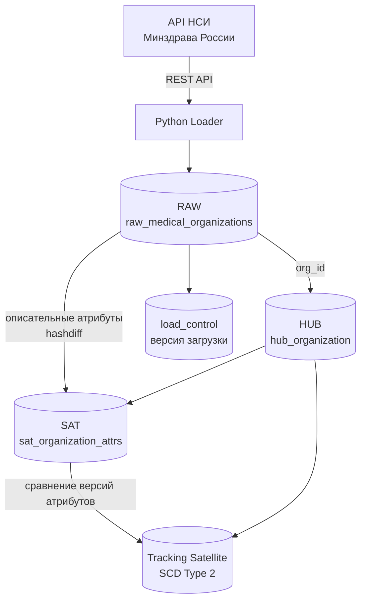
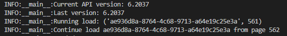
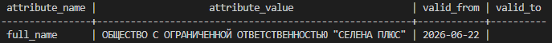
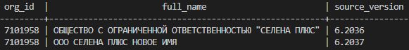
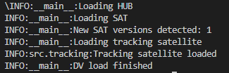
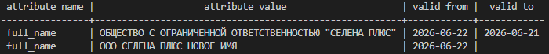
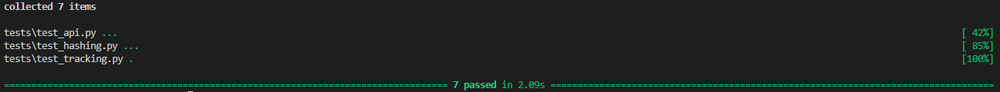

# Пайплайн полного цикла загрузки данных

### Загружает данные из реестра медицинских и фармацевтических организаций с помощью публичного API Минздрава, производит построение версионированного хранилища в концепции Data Vault 2.0 и отслеживает истории изменений по каждой организации.


## Стэк

- Python 3.11
- PostgreSQL 14
- Docker Compose
- pytest


## Архитектура




## Реализации

- Проверка версии API
- Идемпотентная загрузка
- Data Vault 2.0 хэширование
- Обнаружение изменений на основе Hashdiff
- Отслеживание истории изменений атрибутов организаций на основе SCD Type 2

## Структура проекта

### src/
- api.py ----- (клиент API НСИ)
- db.py ----- (подключение PostgreSQL)
- dv_loader.py ----- (построение Data Vault слоя)
- hashing.py ----- (hash key / hashdiff)
- loader.py ----- (загрузка RAW слоя)
- tracking.py ----- (SCD Type 2)

## Data Vault модель

### HUB

Хранит уникальные организации:

- org_id — бизнес-ключ
- hash key — суррогатный ключ

### SAT

Хранит версии атрибутов:

- full_name
- short_name
- inn
- ogrn
- address
- hashdiff

### Tracking Satellite

Хранит историю изменения отдельных атрибутов:

- attribute_name
- old/new value
- valid_from
- valid_to


## Запуск

Клонирование проекта
```
https://github.com/mindrusher/Medical_dv_pipeline.git
```

```
cp env.example .env
```
Добавьте свой API Token в файл .env

Запуск БД:

    docker compose up -d postgres


Запуск загрузчика данных:

    docker compose run --rm loader python -m src.loader

В случае падения перезапустите той же командой, процесс продолжится с последней загруженной страницы




Запуск Data Vault загрузчика:

    docker compose run --rm loader python -m src.dv_loader


Тесты:

    pytest


## Проверка идемпотентности

Первый запуск (src.loader):

```
INFO:__main__:Current API version: 6.2036
INFO:__main__:Loaded page XXX
INFO:__main__:Pipeline finished
```
Повторный запуск:

```
INFO:__main__:Current API version: 6.2036
INFO:__main__:Version already loaded. Skip.
```

SQL:
```
docker exec -it medical_dv_postgres psql -U nsi_user -d nsi_test
```
```
select
    source_version,
    count(*)
from nsi.raw_medical_organizations
group by source_version;
```

## Проверка истории изменений

Для демонстрации SCD2 в RAW добавляется новая версия записи, после чего DV слой создаёт новую версию SAT и закрывает старую запись в Tracking Satellite

SQL:
```
select
    attribute_name,
    attribute_value,
    valid_from,
    valid_to
from nsi.sat_organization_changes c
join nsi.hub_organization h
using(hub_org_hash_key)
where org_id='7101958'
and attribute_name='full_name'
order by valid_from;
```

Пример результата:



Для демонстрации поведения новой версии справочника создаётся новая запись RAW с изменённым атрибутом организации.

```
insert into nsi.raw_medical_organizations
(
    raw_hash_key,
    org_id,
    full_name,
    short_name,
    ogrn,
    inn,
    address,
    ved_affiliation_id,
    inclusion_date,
    raw_payload,
    source_version
)

select
encode(
    digest(
        '7101958_6.2037',
        'sha256'
    ),
    'hex'
),

org_id,
'ООО СЕЛЕНА ПЛЮС НОВОЕ ИМЯ',
short_name,
ogrn,
inn,
address,
ved_affiliation_id,
inclusion_date,

jsonb_set(
    raw_payload,
    '{nameFull}',
    '"ООО СЕЛЕНА ПЛЮС НОВОЕ ИМЯ"'
),
'6.2037'

from nsi.raw_medical_organizations
where org_id='7101958'
limit 1;
```

Результат:



Запуск dv_loader:

```
docker compose run --rm loader python -m src.dv_loader
```

Результат:



Проверяем историю:

```
select
    attribute_name,
    attribute_value,
    valid_from,
    valid_to
from nsi.sat_organization_changes c
join nsi.hub_organization h
using(hub_org_hash_key)
where org_id='7101958'
and attribute_name='full_name'
order by valid_from;
```

Результат:




## Тестирование

Запуск:

pytest

Результат:



## Возможные улучшения

- использование batch insert для ускорения загрузки больших объемов;
- параллельная обработка страниц API;
- вынесение параметров загрузки в конфигурацию;
- добавление мониторинга длительности этапов pipeline.
- оркестрация
